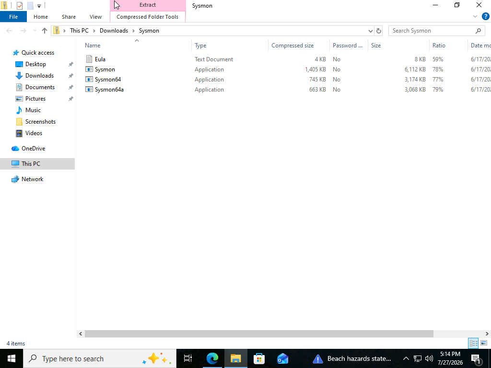
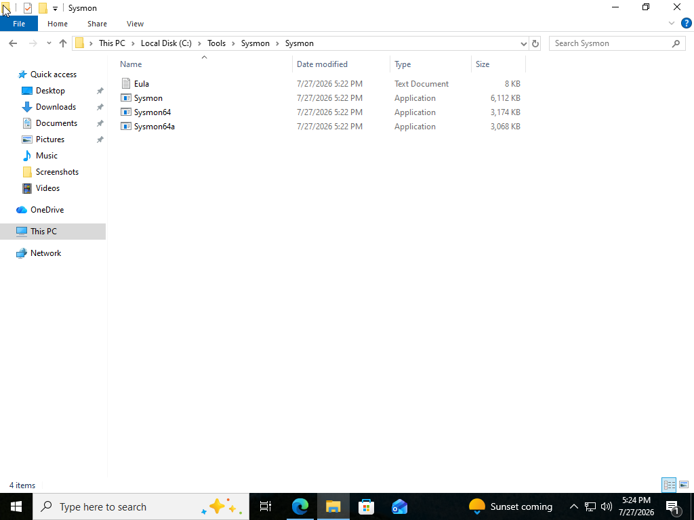
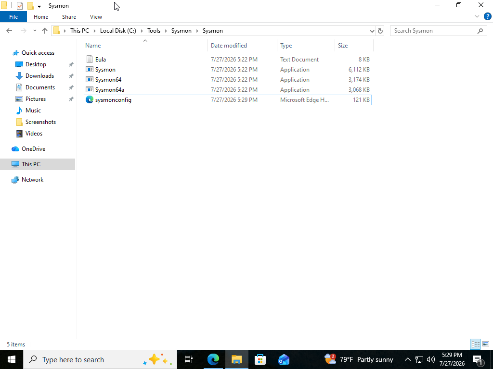
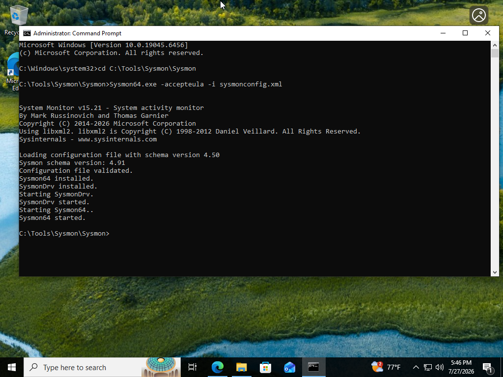
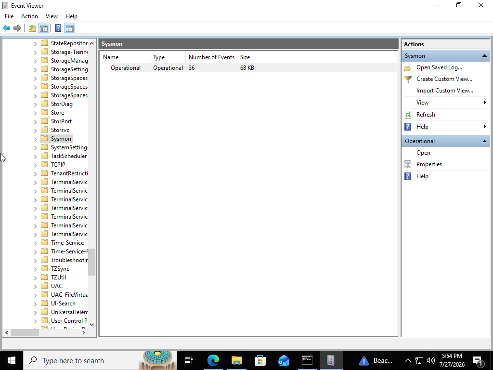
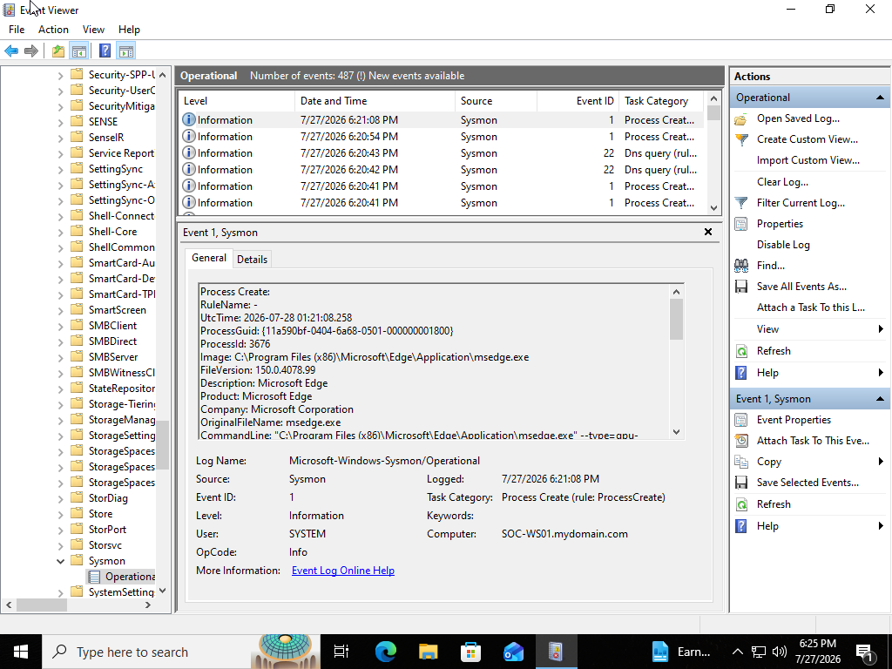
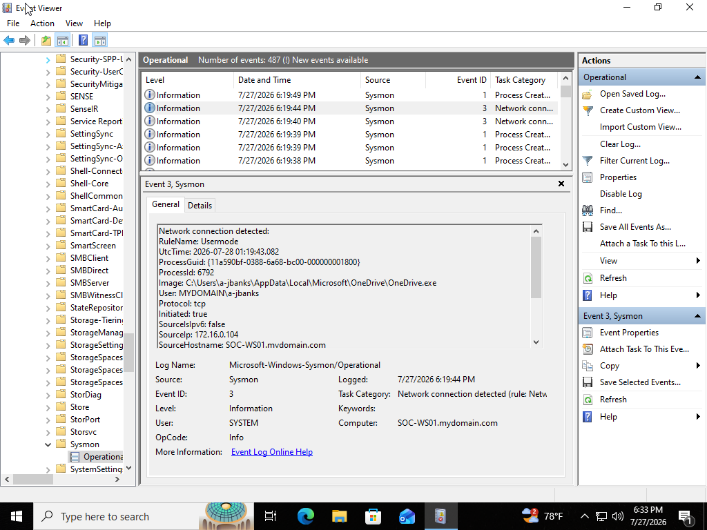
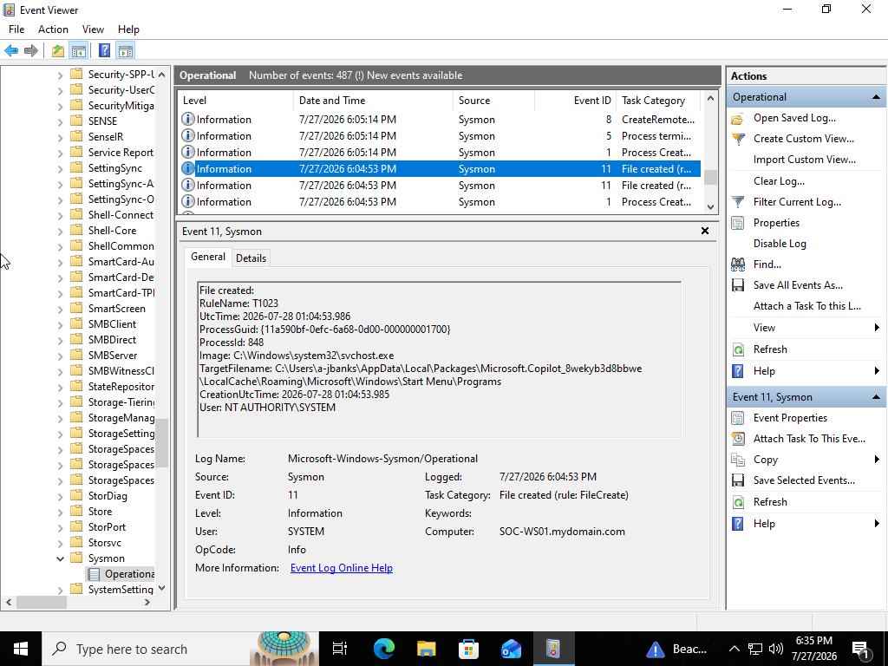
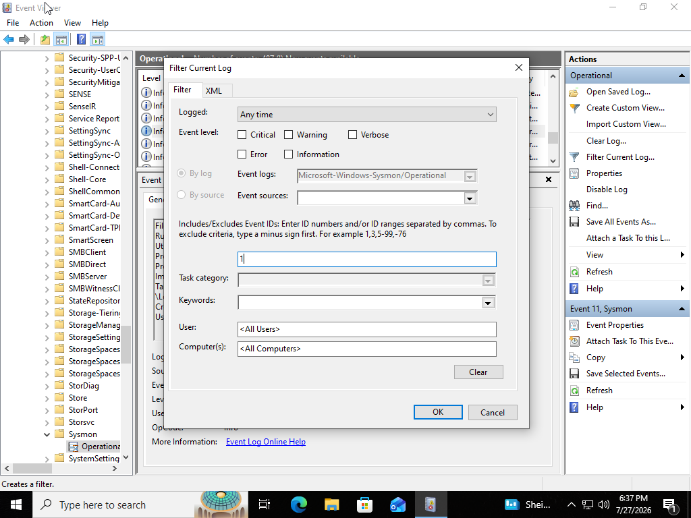
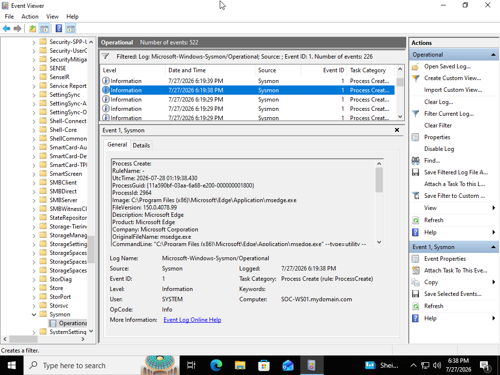

# SOC Analyst Lab #2 - Sysmon and Advanced Logging

## Project Overview

This project demonstrates how Microsoft Sysmon can be used to enhance Windows event logging and provide greater visibility into endpoint activity.

The lab involved installing Sysmon on a Windows virtual machine, applying a Sysmon configuration file, generating system activity, and investigating the resulting events through Windows Event Viewer.

This project builds on my previous Windows Event Log Investigation lab by introducing more detailed endpoint telemetry commonly used by security operations teams.

---

## Objectives

- Install Microsoft Sysmon
- Apply a Sysmon configuration file
- Verify that Sysmon is collecting events
- Generate system and user activity
- Investigate process creation events
- Investigate network connection events
- Investigate file creation events
- Filter Sysmon logs by Event ID
- Document findings from the investigation

---

## Lab Environment

| Component | Details |
|---|---|
| Virtualization Platform | Oracle VirtualBox |
| Operating System | Windows |
| Computer Name | SOC-WS01 |
| Monitoring Tool | Microsoft Sysmon |
| Log Analysis Tool | Windows Event Viewer |
| Configuration | Sysmon XML configuration |

---

## Tools Used

- Microsoft Sysmon
- Windows Event Viewer
- Command Prompt
- PowerShell
- File Explorer
- Microsoft Edge
- Sysmon configuration file

---

## Investigation Scenario

A Windows workstation requires enhanced endpoint logging so that security analysts can investigate system activity in greater detail.

Sysmon was installed and configured to collect telemetry related to process execution, network connections, file creation, and other endpoint activity.

As the SOC analyst, the objective was to verify that Sysmon was functioning properly, generate test activity, and analyze the resulting event data.

---

## Sysmon Installation

Sysmon was downloaded from Microsoft Sysinternals and extracted into the following directory:

```text
C:\Tools\Sysmon
```

The Sysmon executable and configuration file were stored together to simplify installation and management.

Sysmon was installed from an elevated Command Prompt using:

```cmd
Sysmon64.exe -accepteula -i sysmonconfig.xml
```

The `-accepteula` option accepted the Microsoft Sysinternals license agreement, while the `-i` option installed Sysmon using the specified configuration file.

---

## Verifying Sysmon

After installation, Sysmon events were verified in Event Viewer under:

```text
Applications and Services Logs
Microsoft
Windows
Sysmon
Operational
```

The Sysmon Operational log contained detailed endpoint events that were not available in the standard Windows Security, System, or Application logs.

---

## Activity Generated

To produce events for analysis, several actions were performed on the workstation:

- Opened Command Prompt
- Opened PowerShell
- Opened Notepad
- Opened Calculator
- Ran `whoami`
- Ran `hostname`
- Ran `ipconfig`
- Ran `net user`
- Opened Microsoft Edge
- Created a text file
- Deleted a text file
- Restarted the virtual machine

These actions generated Sysmon telemetry that could be reviewed in Event Viewer.

---

## Event ID 1 - Process Creation

Sysmon Event ID **1** records when a new process is created.

Information available in this event can include:

- Process image
- Process ID
- Parent process
- Command line
- User account
- Process hashes
- Process creation time

Process creation events are valuable during security investigations because they allow analysts to determine which applications and commands were executed on a system.

For example, opening Command Prompt or running commands such as `whoami` and `ipconfig` can generate process creation events.

---

## Event ID 3 - Network Connection

Sysmon Event ID **3** records network connections initiated by processes.

Information available may include:

- Source process
- Source IP address
- Source port
- Destination IP address
- Destination port
- Network protocol
- User account

Network connection events help analysts identify which processes communicated over the network and where those connections were directed.

This can be useful when investigating suspicious outbound traffic, malware communication, or unauthorized remote access.

---

## Event ID 11 - File Create

Sysmon Event ID **11** records when a file is created or overwritten.

Information available may include:

- File path
- File name
- Process responsible for the action
- User account
- Timestamp

File creation events help analysts identify newly created files that may be associated with malware, scripts, downloaded tools, or other suspicious activity.

During this lab, a text file was created to generate file-related telemetry.

---

## Filtering Sysmon Events

The **Filter Current Log** feature in Event Viewer was used to isolate specific Sysmon Event IDs.

Filtering by Event ID allows analysts to quickly reduce a large number of log entries and focus only on events relevant to an investigation.

For example, filtering by:

```text
1
```

displayed only process creation events.

---

## Investigation Findings

The Sysmon investigation confirmed that the monitoring service was collecting detailed endpoint telemetry.

The collected events showed:

- Applications launched by the user
- Commands executed through Command Prompt
- Parent and child process relationships
- Network connections initiated by applications
- Files created during the lab
- User accounts associated with system activity
- Timestamps for each recorded action

Compared with standard Windows logging, Sysmon provided significantly more context about how processes were executed and how they interacted with the system and network.

---

## Key Sysmon Event IDs

| Event ID | Description |
|---|---|
| 1 | Process creation |
| 3 | Network connection |
| 7 | Image loaded |
| 11 | File create |
| 12 | Registry object created or deleted |
| 13 | Registry value set |
| 22 | DNS query |
| 23 | File delete |
| 25 | Process tampering |

The events available depend on the Sysmon configuration being used.

---

## Skills Demonstrated

- Sysmon installation and configuration
- Windows endpoint monitoring
- Event Viewer navigation
- Process creation analysis
- Network connection analysis
- File creation analysis
- Event ID filtering
- Basic endpoint investigation
- Security log documentation
- Troubleshooting administrator permissions and file paths

---

## Troubleshooting

During the installation process, the Sysmon executable and configuration file were initially stored inside a nested folder structure.

The Command Prompt also needed to be opened with administrator privileges before Sysmon could be installed successfully.

The issue was resolved by:

1. Identifying the correct folder containing `Sysmon64.exe`
2. Navigating to the correct directory
3. Opening Command Prompt as an administrator
4. Running the installation command again

This reinforced the importance of verifying file paths, folder structure, and administrative privileges when installing system-level monitoring tools.

---

## Lessons Learned

This lab provided hands-on experience installing and using Sysmon to improve Windows endpoint visibility.

I learned that Sysmon provides more detailed information than standard Windows logs, especially when investigating process execution, parent-child process relationships, command-line activity, network connections, and file creation.

I also learned that the quality and quantity of Sysmon events depend heavily on the configuration file being used.

The lab reinforced the importance of combining technical investigation skills with clear documentation and troubleshooting.

---

## Screenshots

### Sysmon Download Files



---

### Sysmon Folder Structure



---

### Sysmon Configuration File



---

### Sysmon Installation



---

### Sysmon Operational Log



---

### Event ID 1 - Process Creation



---

### Event ID 3 - Network Connection



---

### Event ID 11 - File Create



---

### Filter Current Log



---

### Investigation Results



---

## Conclusion

This lab demonstrated how Microsoft Sysmon can enhance Windows logging by collecting detailed endpoint telemetry.

By analyzing Sysmon events in Windows Event Viewer, I was able to investigate process execution, network activity, file creation, command-line activity, and user actions.

These skills establish a foundation for future labs involving Microsoft Defender, Microsoft Sentinel, Kusto Query Language, threat hunting, detection engineering, and incident response.
